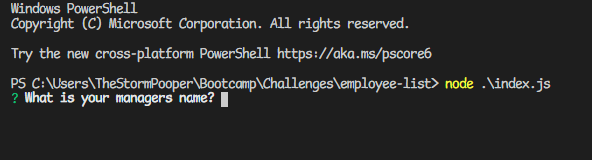

# employee-list

My task was to make a Node.js command-line application that takes in information about employees on a software engineering team, then generates an HTML webpage that displays summaries for each person. I used [Jest](https://www.npmjs.com/package/jest) and [Inquirer](https://www.npmjs.com/package/inquirer) to ask for the employees and test my classes.

## User Story

```md
AS A manager
I WANT to generate a webpage that displays my team's basic info
SO THAT I have quick access to their emails and GitHub profiles
```



The application can be invoked by using the following command:

```bash
node index.js
```

## Classes

The first class is an `Employee` parent class with the following properties and methods:

* `name`

* `id`

* `email`

* `getName()`

* `getId()`

* `getEmail()`

* `getRole()`&mdash;returns `'Employee'`

The other three classes extend `Employee`.

In addition to `Employee`'s properties and methods, `Manager` also has the following:

* `officeNumber`

* `getRole()`&mdash;overridden to return `'Manager'`

In addition to `Employee`'s properties and methods, `Engineer` also has the following:

* `github`&mdash;GitHub username

* `getGithub()`

* `getRole()`&mdash;overridden to return `'Engineer'`

In addition to `Employee`'s properties and methods, `Intern` also has the following:

* `school`

* `getSchool()`

* `getRole()`&mdash;overridden to return `'Intern'`